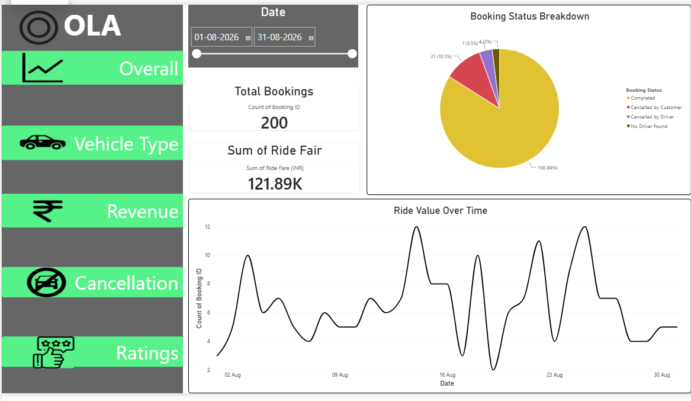
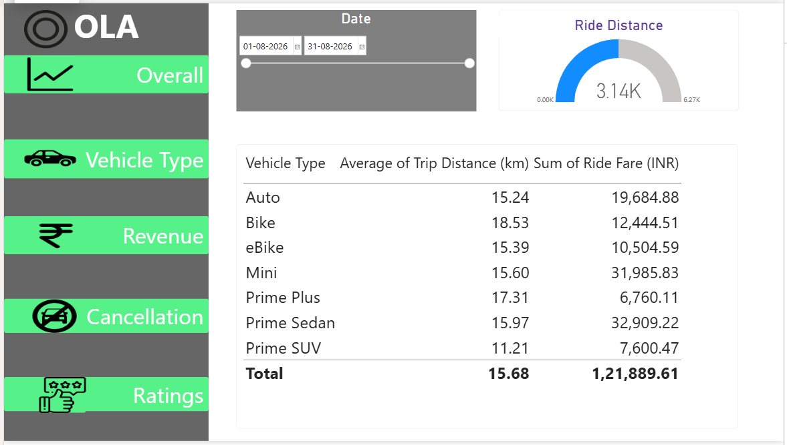
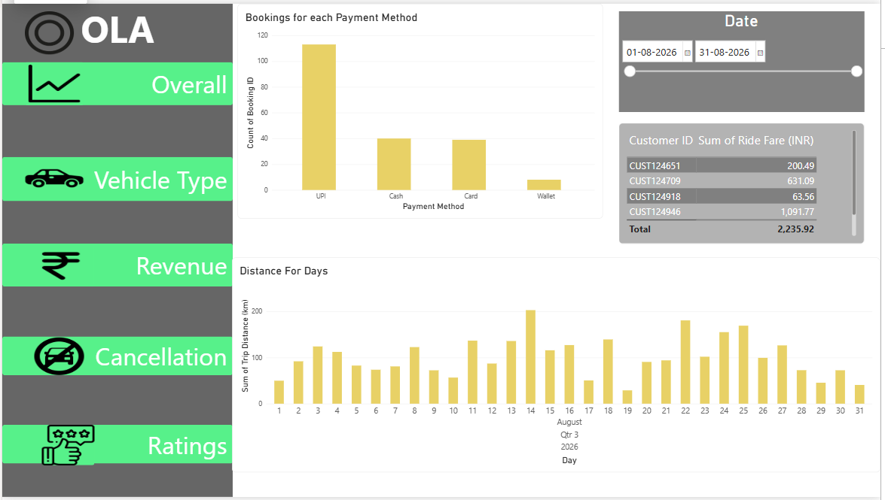
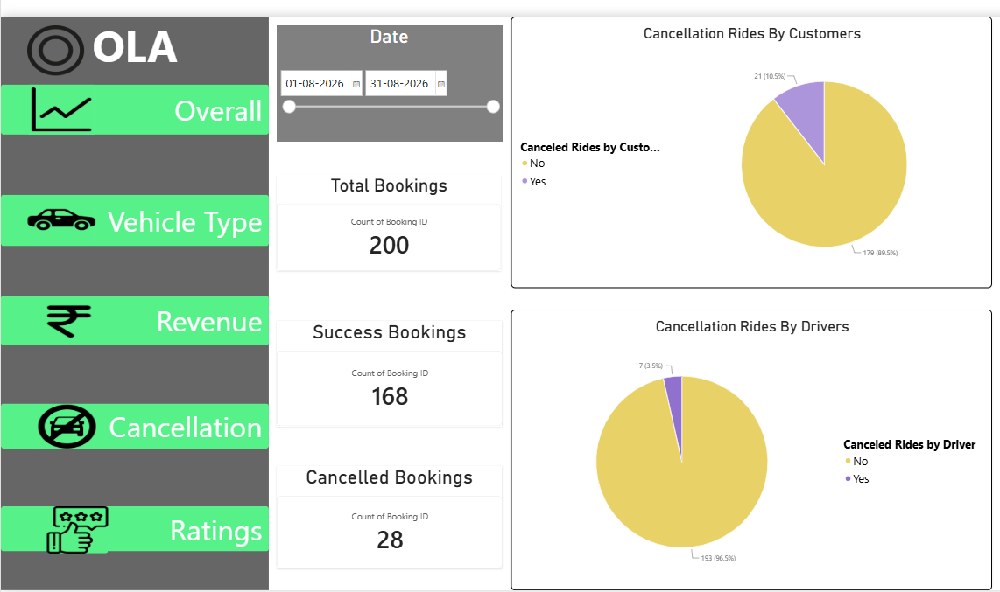
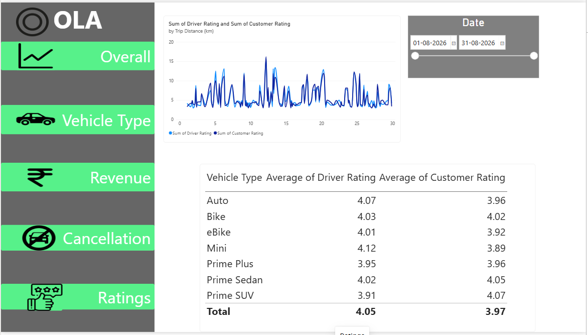

# 📊 Booking Data Analytics Project

## 📌 Project Overview

This project is an end-to-end data analytics project based on booking data. 
The project uses SQL for data analysis and Power BI to create an interactive 
dashboard for visualizing key business metrics and trends.

## 🛠️ Tools Used

- SQL
- Power BI
- CSV / Excel
- GitHub

## 🔍 SQL Analysis

The SQL queries cover:

- Booking and cancellation analysis
- Successful and cancelled rides
- Driver performance
- Driver ratings
- Vehicle type performance
- Revenue analysis
- Average fare and customer wait time

## 📊 Power BI Dashboard

The dashboard contains 5 pages:

1. **Overall** – Booking overview and key KPIs
2. **Vehicle Type** – Analysis by vehicle type
3. **Revenue** – Revenue and fare analysis
4. **Cancellation** – Cancellation analysis
5. **Ratings** – Rating and performance analysis

## 📈 Dashboard Preview
### Dashboard Preview

#### Overall Dashboard

#### Vehicle Type Analysis

#### Revenue Analysis

#### Cancellation Analysis

#### Ratings Analysis

## 🎯 Skills Demonstrated

- SQL Querying
- Data Analysis
- Data Visualization
- Power BI Dashboard Development
- KPI Analysis
- Business Insights

## 👩‍💻 Author

**Muskan Bisht**

BCA Final Year Student | Aspiring Data Analyst
